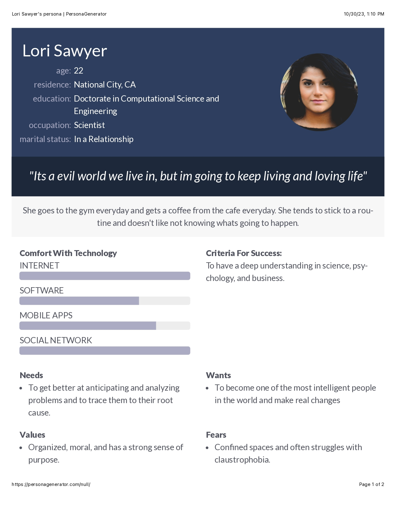

<!DOCTYPE html> 
<html>
  <head>
    <title>CSCE 190:mikera-hall</title>
    <link rel = "stylesheet" href="styles.css"
  </head>
  <body>
    <h1>mikera-hall</h1>
    <section class="assign">
      
        <h2>Problem statement: [Adjusting to College]</h2>
        

          [Adjusting to college is a hard task for most students. Coming straight out of high school to being alone, finding a job, and being independent. Students need to find ways to help get adjusted to that.. ]
          

        </section>
      </section>
<!-- Affinity Diagram assignment -->
<section class = "assign">
<section class="assign-det">
  <a href="images/Screenshot%202023-10-02%20at%2010.46.38%20PM.png"><h2>Affinity diagram: [Adjusting to College]</h2>
    

      [An outline and detailed ideas of how to improve your college experience]
    

</section>
</section>

<!-- Personas assignment -->
<section class="assign">

<section class="assign-det">
<a href="images/combinepdf.pdf"><h2>Team Personas: [title]</h2></a>

[Lori Sawyer "Its a evil world we live in, but im going to keep living and loving life"]

</section>
</section>

</body>
</html>
